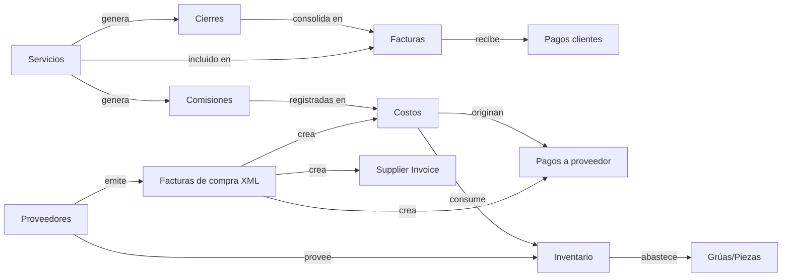

# Integración cruzada entre módulos (Cross-Module Data Integration)

> Documento maestro que explica la **característica principal** de la aplicación: cómo todos los módulos comparten una única base de datos y se sincronizan entre sí en tiempo real, evitando doble ingreso e inconsistencias.

---

## 1. Resumen ejecutivo

La aplicación funciona como un **ERP integrado**: cada acción que el usuario realiza en un módulo (Servicios, Facturas, Costos, Inventario, Proveedores, Comisiones, Grúas, Cierres) **propaga automáticamente** sus efectos a los demás módulos relacionados, manteniendo una **única fuente de verdad** en la base de datos. El usuario no necesita re-ingresar información ni reconciliar manualmente entre pantallas: el sistema garantiza la coherencia.

---

## 2. Nombre técnico y conceptos clave

| Término | Definición operativa en este proyecto |
|---|---|
| **Cross-Module Data Integration** / Integración cruzada | Patrón general: módulos distintos consumen y modifican datos compartidos. |
| **ERP integrado** | Categoría comercial. La app cumple las características de un ERP de operación de grúas. |
| **Single Source of Truth (SSOT)** | Cada dato vive en una tabla canónica única (ej. `costs` para comisiones, `services` para datos del servicio). |
| **Referential Integrity** | Foreign keys + RLS en Supabase mantienen las relaciones consistentes. |
| **Cascading Operations** | Una acción dispara, en cadena, escrituras/borrados coordinados en varias tablas. |
| **Bidirectional Sync** | Cambiar un registro en módulo A actualiza el espejo en módulo B, y viceversa, con prevención de bucles. |
| **Data Orchestration** | Servicios "orquestadores" (ej. `UnifiedPurchaseService`) ejecutan transacciones lógicas multi-tabla. |
| **Event-Driven Architecture** | Triggers de Postgres + Supabase Realtime + invalidación de React Query propagan cambios. |
| **Domain-Driven Design (Bounded Contexts)** | Cada módulo es un dominio acotado (Servicios, Finanzas, Inventario…) con puntos de integración explícitos. |

---

## 3. Mapa de integración entre módulos



---

## 4. Ejemplos reales de cada patrón

### Ejemplo 1 — Orquestación de datos (Data Orchestration)

**Caso de uso:** registrar la compra de un repuesto.
**Una sola acción del usuario** dispara escrituras coordinadas en **8 tablas**:

- `inventory_items` (alta del ítem si es nuevo)
- `inventory_locations` (ubicación en bodega)
- `inventory_stock` (stock actualizado)
- `inventory_movements` (movimiento de entrada)
- `costs` (gasto registrado)
- `cost_categories` (categoría resuelta)
- `crane_parts` (si es consumo inmediato a una grúa)
- `supplier_invoice_items` (línea de factura de proveedor)

**Implementación:** `src/services/UnifiedPurchaseService.ts → registerPurchase()`

```ts
const result = await UnifiedPurchaseService.registerPurchase({
  itemName: 'Filtro hidráulico',
  quantity: 2,
  unitCost: 35000,
  date: '2026-05-15',
  immediateConsumption: true,
  craneId: 'uuid-grua'
})
```

Si cualquier paso falla, el servicio intenta **rollback parcial** y mantiene la idempotencia (reusa movimientos existentes en reintentos).

---

### Ejemplo 2 — Operaciones en cascada (Cascading Operations)

**Caso de uso:** liberar una factura para corregir un error.
**Una sola acción** ejecuta, en cascada:

1. Eliminar `invoice_services` (vínculos servicio↔factura).
2. Eliminar `invoice_closures` (vínculos cierre↔factura).
3. Para cada cierre vinculado:
   - Si está compartido con otra factura → revertir a estado "Cerrado".
   - Si no → eliminar `closure_services`, `service_closures` y el cierre completo.
4. Eliminar la factura.
5. Resetear los servicios afectados a `with_purchase_order` para poder re-procesarlos.

**Implementación:** `src/hooks/useServiceLiberation.ts → liberateInvoice()`
UI: `src/components/admin/ServiceLiberationTool.tsx`

---

### Ejemplo 3 — Sincronización bidireccional (Bidirectional Sync)

**Caso de uso:** un costo asociado a un proveedor y su pago siempre deben reflejar lo mismo.

- Si registras un **pago** en el módulo de Proveedores → el `costo` correspondiente se marca como `paid`.
- Si editas el **monto** del costo → el `supplier_payment` se actualiza.
- El sistema previene **bucles infinitos** mediante una bandera de origen (la escritura que viene del sync no vuelve a disparar el sync).

**Memoria de referencia:** [`supplier-payment-cost-sync-v2`](mem://business-rules/supplier-payment-cost-sync-v2)
**Lógica:** `src/utils/syncToast.ts` + hooks en `src/hooks/suppliers/*`

---

### Ejemplo 4 — Single Source of Truth (SSOT)

**Caso de uso:** comisiones de operadores.

- **Fuente canónica:** tabla `costs` con `category_id = comisiones`.
- **Campos legacy** en `services.operator_id` y `services.operator_commission` se mantienen sincronizados pero **no son la fuente de verdad** — solo un caché para queries rápidas.
- Cualquier reporte, dashboard o liquidación de comisiones consulta `costs`, nunca el campo legacy.

**Memoria de referencia:** [`commissions-overhaul`](mem://features/commissions/system-overhaul)
**Sync legacy:** `src/hooks/services/useAdvancedServiceSync.ts → syncCommissionsRobust()`

---

### Ejemplo 5 — Verificación y auto-reparación de consistencia

**Caso de uso:** detectar y corregir desfases entre tablas.

El hook `useAdvancedServiceSync` ofrece dos funciones:

- **`verifyConsistency(serviceId)`** — Compara `services` ↔ `service_resources` ↔ `costs` y devuelve la lista de issues encontrados (ej. "operador X tiene comisión en `service_resources` pero no en `costs`").
- **`autoRepair(serviceId)`** — Si hay issues, ejecuta el sync robusto completo y los resuelve.

**Implementación:** `src/hooks/services/useAdvancedServiceSync.ts`
**RPC equivalente a nivel BD:** `validate_payment_system_integrity` y `fix_payment_system_inconsistencies`.

---

### Ejemplo 6 — Sincronización en tiempo real (Realtime UI)

**Caso de uso:** un usuario crea un costo en su navegador → otro usuario, en otra pantalla viendo Inventario, ve el cambio sin recargar.

- **Capa BD:** Supabase Realtime emite eventos `INSERT/UPDATE/DELETE` por canal.
- **Capa app:** `useUnifiedRealtimeManager` escucha los canales y, ante cualquier cambio, llama a `useUniversalSync.invalidateAll()`.
- **Resultado:** React Query invalida y refetcha automáticamente las queries afectadas (`costs`, `inventory-stock`, `crane-consumptions`, `supplier-payments`, etc.).

**Implementación:**
- `src/hooks/useUnifiedRealtimeManager.ts`
- `src/hooks/useUniversalSync.ts → invalidateAll()`

```ts
const { invalidateAll, refetchCritical } = useUniversalSync()
await invalidateAll()      // marca queries como stale
await refetchCritical()    // refetch inmediato de las críticas
```

---

### Ejemplo 7 — Sincronización triangular (3 dominios a la vez)

**Caso de uso:** importar un XML DTE (factura electrónica chilena) de un proveedor.

Una sola importación crea, en simultáneo y enlazados entre sí:

1. **Costo** en `costs` (gasto contable).
2. **Pago a proveedor** en `supplier_payments` (con fecha derivada de `FmaPago`).
3. **Factura de compra** en `supplier_invoices` (documento original).

Los tres registros mantienen referencias cruzadas (ids) que permiten navegar entre ellos desde cualquier módulo.

**Memorias de referencia:**
- [`xml-triangular-synchronization`](mem://features/suppliers/xml-triangular-synchronization)
- [`xml-import-financial-logic-v1`](mem://features/costs/xml-import-financial-logic-v1)

**Detección de duplicados** en 3 niveles para evitar reimportar.

---

### Ejemplo 8 — Propagación de estados (Status Propagation)

**Caso de uso:** cuando una factura cambia a `paid`, todos los servicios contenidos cambian a `invoiced + paid`.

Esto se ejecuta a nivel **base de datos** mediante triggers de Postgres, garantizando la propagación incluso si el cambio viene de una RPC, una migración o un cliente externo.

**Memorias de referencia:**
- [`service-invoice-status-sync`](mem://data-integrity/service-invoice-status-sync)
- [`service-status-trigger-logic`](mem://data-integrity/service-status-trigger-logic)

---

## 5. Mecanismos técnicos que lo hacen posible

| Capa | Mecanismo | Dónde vive |
|---|---|---|
| **Base de datos** | Foreign keys, constraints UNIQUE, RLS policies | `supabase/migrations/*` |
| **Base de datos** | Triggers de Postgres (status sync, auditoría) | Migraciones SQL |
| **Base de datos** | RPC functions: `apply_payment_manual`, `smart_apply_payment`, `validate_payment_system_integrity`, `global_inventory_cleanup`, `fix_payment_system_inconsistencies` | `supabase/migrations/*` |
| **Backend lógico (frontend)** | Servicios orquestadores | `src/services/*` (ej. `UnifiedPurchaseService`) |
| **Hooks de sincronización** | Sync robusto, verificación, auto-reparación | `src/hooks/services/useAdvancedServiceSync.ts` |
| **Realtime UI** | Suscripciones Supabase + invalidación React Query | `src/hooks/useUnifiedRealtimeManager.ts`, `src/hooks/useUniversalSync.ts` |
| **Auditoría** | `service_change_history`, `created_by`, logs de backup | `src/components/shared/ChangeHistoryPanel.tsx` |
| **Resiliencia offline** | IndexedDB v5 + cola de sincronización | Memoria [`offline-full-capability-v5`](mem://features/offline/full-capability-v5) |

---

## 6. Cómo explicarlo a una persona no técnica

> "La app funciona como un **ERP integrado**: todos los módulos —servicios, facturas, costos, inventario, proveedores, grúas— **comparten una única base de datos** y se actualizan entre sí en tiempo real. Cuando registras algo en un módulo, los demás se enteran automáticamente: si emites una factura, los servicios incluidos quedan marcados como facturados; si registras un pago, el costo asociado se marca como pagado; si haces una compra de repuestos, se actualizan al mismo tiempo el inventario, el gasto contable y la pieza asignada a la grúa. **No hay doble ingreso, no hay reconciliación manual, no hay datos desincronizados.**"

**Frase comercial corta:**
> *Plataforma ERP integrada con sincronización en tiempo real entre los módulos operacionales y financieros del negocio de grúas.*

---

## 7. Beneficios medibles

- ✅ **Cero doble ingreso** de información (un mismo dato no se captura dos veces).
- ✅ **Integridad referencial garantizada** (no existen "facturas huérfanas" ni "pagos sin costo").
- ✅ **Trazabilidad end-to-end** (de un servicio puedes navegar a su cierre, factura, pago, costos y comisiones asociadas).
- ✅ **Auditoría automática** de quién y cuándo cambió cada registro.
- ✅ **UX coherente**: lo que ves en una pantalla coincide siempre con lo de otra.
- ✅ **Tolerancia a errores**: el sistema detecta y repara inconsistencias por sí solo.

---

## 8. Referencias cruzadas

- [`docs/modules/services.md`](../modules/services.md)
- [`docs/modules/invoices.md`](../modules/invoices.md)
- [`docs/modules/costs.md`](../modules/costs.md)
- [`docs/modules/inventory.md`](../modules/inventory.md)
- [`docs/modules/suppliers.md`](../modules/suppliers.md)
- [`docs/modules/commissions.md`](../modules/commissions.md)
- [`docs/modules/closures.md`](../modules/closures.md)
- [`docs/technical/payment-system.md`](../technical/payment-system.md)
- [`docs/modules/supabase-integration.md`](../modules/supabase-integration.md)
- [`docs/architecture/overview.md`](./overview.md)

---

_Última actualización: 2026-05-15_